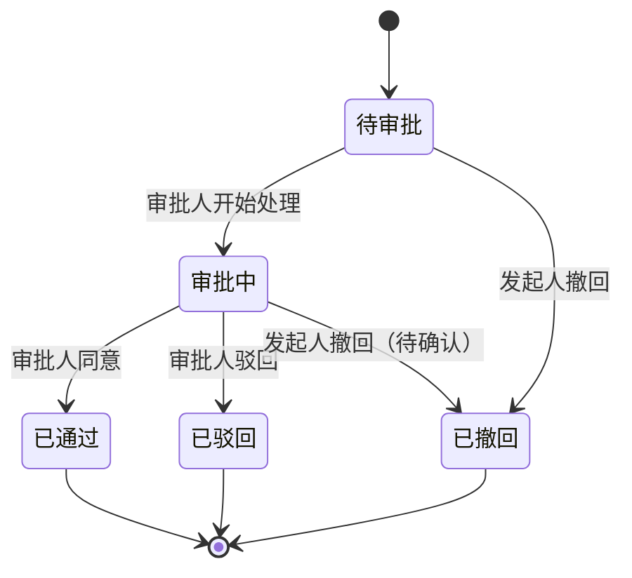

# 行业模板：审批流状态机

> **何时使用**：用户提到审批/审核/工作流/OA 等场景时，作为参考模板。
> **覆盖范围**：5 状态审批流 / 转交/撤回/驳回 / 终态吸收 / 并发冲突场景。

## 1. 业务背景

企业 OA 审批流，涉及发起人、审批人、抄送人三类参与者。审批单从发起到结束有 5 个状态，含审批/撤回/驳回/会签等流程。

## 2. 状态机模型

```yaml
state_machine:
  meta:
    object: Approval
    version: 1.0
    source: OA 系统通用规则
    confidence: medium
  states:
    - name: 待审批
      meaning: 审批单已提交，等待审批人处理
      is_initial: true
      is_terminal: false
      entry_events: [审批单提交]
      invariants:
        - 审批内容不可修改
        - 审批人已指定
    - name: 审批中
      meaning: 审批人正在处理（含会签场景）
      is_terminal: false
      entry_events: [审批人开始处理]
      invariants:
        - 审批人不可变更
        - 审批意见尚未最终提交
    - name: 已通过
      meaning: 审批通过，业务流程继续
      is_terminal: true
      entry_events: [审批人同意]
      invariants:
        - 审批结果不可修改
        - 审批记录已归档
    - name: 已驳回
      meaning: 审批被驳回，发起人可修改后重新提交
      is_terminal: true
      entry_events: [审批人驳回]
      invariants:
        - 驳回原因已记录
        - 不可在同一审批单上继续操作
    - name: 已撤回
      meaning: 发起人主动撤回审批
      is_terminal: true
      entry_events: [发起人撤回]
      invariants:
        - 撤回时间已记录
        - 不可恢复
  transitions:
    - from: 待审批
      to: 审批中
      event: 审批人开始处理
      side_effects: [记录处理开始时间, 通知发起人]
      evidence_type: 需求明确
      source: PRD §2.1
    - from: 审批中
      to: 已通过
      event: 审批人同意
      guards: [所有会签人已同意]
      side_effects: [记录审批意见, 触发后续业务流程, 通知发起人]
      evidence_type: 需求明确
      source: PRD §2.2
    - from: 审批中
      to: 已驳回
      event: 审批人驳回
      guards: [驳回原因已填写]
      side_effects: [记录驳回原因, 通知发起人]
      evidence_type: 需求明确
      source: PRD §2.3
    - from: 待审批
      to: 已撤回
      event: 发起人撤回
      side_effects: [记录撤回时间, 通知审批人]
      evidence_type: 需求明确
      source: PRD §2.4
    - from: 审批中
      to: 已撤回
      event: 发起人撤回
      guards: [审批人尚未提交最终意见]
      side_effects: [记录撤回时间, 通知审批人]
      evidence_type: 待确认
      source: PRD 未说明审批中能否撤回
  forbidden:
    - from: 已通过
      to: "*"
      reason: 终态吸收
      evidence_type: 需求明确
    - from: 已驳回
      to: "*"
      reason: 终态吸收（重新提交需新建审批单）
      evidence_type: 需求明确
    - from: 已撤回
      to: "*"
      reason: 终态吸收
      evidence_type: 需求明确
    - from: 待审批
      to: 已通过
      reason: 必须经过审批中状态
      evidence_type: 合理推理
    - from: 待审批
      to: 已驳回
      reason: 必须经过审批中状态
      evidence_type: 合理推理
```

## 3. 完整性检查报告

```yaml
completeness_report:
  overall_status: warn
  checks:
    - check_id: C1
      name: 每个状态有明确含义
      status: pass
    - check_id: C2
      name: 每个状态有进入条件（除初始态）
      status: pass
    - check_id: C3
      name: 每个非终态有退出路径
      status: pass
    - check_id: C4
      name: 终态真的不可变化
      status: pass
    - check_id: C5
      name: 禁止转换无遗漏
      status: warn
      detail: 需澄清"审批中 → 待审批"（退回补充材料）是否允许
    - check_id: C6
      name: 状态变化有副作用定义
      status: pass
    - check_id: C7
      name: 依据类型已标注
      status: pass
    - check_id: C8
      name: 无悬挂状态
      status: pass
    - check_id: C9
      name: 无死锁状态
      status: pass
  gaps:
    - id: GAP-001
      description: 审批中能否撤回未明确
      evidence_type: 待确认
      suggestion: 需澄清审批人开始处理后，发起人是否仍可撤回
      related_state: 审批中
    - id: GAP-002
      description: 审批中能否退回待审批（补充材料）
      evidence_type: 待确认
      suggestion: 需澄清是否允许"审批中 → 待审批"退回
      related_state: 审批中
```

## 4. 10 类场景示例（每类 1 条）

```yaml
scenarios:
  - id: SM-001
    title: 待审批单审批人开始处理后转为审批中
    current_state: 待审批
    trigger_event: 审批人开始处理
    precondition: 审批单已提交，审批人已指定
    expected_target_state: 审批中
    forbidden_states: [已通过, 已驳回]
    risk_type: legal_transition
    related_objects: [审批单, 审批日志]
    evidence_type: 需求明确
    source: PRD §2.1

  - id: SM-002
    title: 已通过审批单尝试再次审批应被拒绝
    current_state: 已通过
    trigger_event: 审批人同意
    precondition: 审批单已通过
    expected_target_state: 已通过（保持不变）
    forbidden_states: [已驳回, 已撤回]
    risk_type: illegal_transition
    related_objects: [审批单, 审批日志]
    evidence_type: 需求明确
    source: 状态机 forbidden 规则（终态吸收）

  - id: SM-003
    title: 会签场景下部分审批人未同意时不应通过
    current_state: 审批中
    trigger_event: 审批人同意
    precondition: 会签场景，3 个审批人中仅 2 个同意
    expected_target_state: 审批中（保持不变）
    forbidden_states: [已通过]
    risk_type: guard_violation
    related_objects: [审批单, 会签记录]
    evidence_type: 合理推理
    source: 状态机 transitions 中 guard "所有会签人已同意" 的反向

  - id: SM-004
    title: 审批人同意事件重复到达不应重复触发后续业务
    current_state: 已通过
    trigger_event: 审批人同意（重复）
    precondition: 审批单已通过，收到第二次同意事件
    expected_target_state: 已通过（保持不变）
    forbidden_states: [重复触发后续业务流程]
    risk_type: idempotency
    related_objects: [审批单, 业务流程触发记录]
    evidence_type: 合理推理
    source: 业务常识

  - id: SM-005
    title: 发起人撤回与审批人同意并发时最终状态正确
    current_state: 审批中
    trigger_event: 发起人撤回 + 审批人同意（同时到达）
    precondition: 审批中状态，发起人点撤回的同时审批人点同意
    expected_target_state: 待确认
    forbidden_states: []
    risk_type: concurrency
    related_objects: [审批单, 锁机制, 审批日志]
    evidence_type: 待确认
    source: PRD 未说明并发处理规则

  - id: SM-006
    title: 会签审批人意见乱序到达时状态正确
    current_state: 审批中
    trigger_event: 审批人 A 同意 + 审批人 B 驳回（乱序到达）
    precondition: 会签场景，A 和 B 意见相反，消息乱序
    expected_target_state: 待确认
    forbidden_states: []
    risk_type: message_reorder
    related_objects: [消息队列, 会签记录]
    evidence_type: 待确认
    source: PRD 未说明乱序时以最后一条/拒绝优先/同意优先为准

  - id: SM-007
    title: 待审批单超过 7 天未处理应自动通知
    current_state: 待审批
    trigger_event: 超时定时器（7 天）
    precondition: 审批单提交后 7 天未被处理
    expected_target_state: 待审批（保持不变，仅通知）
    forbidden_states: []
    risk_type: timeout_retry
    related_objects: [定时任务, 通知系统]
    evidence_type: 待确认
    source: PRD 未说明超时处理规则

  - id: SM-008
    title: 审批通过后审批记录与业务流程触发一致
    current_state: 审批中
    trigger_event: 审批人同意
    precondition: 审批中状态，所有会签人同意
    expected_target_state: 已通过
    forbidden_states: [审批记录与业务流程不一致]
    risk_type: data_consistency
    related_objects: [审批单, 审批记录, 业务流程]
    evidence_type: 合理推理
    source: 状态机 transitions 中 side_effects 的验证

  - id: SM-009
    title: 非审批人尝试审批应被拒绝
    current_state: 审批中
    trigger_event: 审批人同意（非指定审批人操作）
    precondition: 操作者为非指定审批人
    expected_target_state: 审批中（保持不变）
    forbidden_states: [已通过]
    risk_type: access_control
    related_objects: [权限系统, 操作日志]
    evidence_type: 待确认
    source: PRD 未说明审批权限校验规则

  - id: SM-010
    title: 审批中状态审批系统故障后状态恢复
    current_state: 审批中
    trigger_event: 系统故障恢复
    precondition: 审批中状态时系统故障，恢复后状态可能不一致
    expected_target_state: 审批中（应保持不变）
    forbidden_states: []
    risk_type: failure_recovery
    related_objects: [审批单, 系统日志, 数据库]
    evidence_type: 待确认
    source: PRD 未说明故障恢复策略
```

## 5. Mermaid 状态图



## 6. 待确认项汇总

| ID | 待确认问题 | 影响范围 |
|---|---|---|
| GAP-001 | 审批中能否撤回 | 审批中 → 已撤回 转换 |
| GAP-002 | 审批中能否退回待审批（补充材料） | 审批中 → 待审批 转换 |
| AMB-001 | 超时未处理是通知/自动驳回/转交 | timeout_retry 类场景 |
| AMB-002 | 会签意见冲突时以何为准 | message_reorder / concurrency 类场景 |
| AMB-003 | 审批人能否转让审批权 | access_control 类场景 |

---

**相关模板**：
- [order-refund.md](order-refund.md) - 订单退款状态机
- [membership.md](membership.md) - 会员状态机
- [ticket.md](ticket.md) - 工单状态机

**相关文档**：
- [../state-modeling.md](../state-modeling.md) - 状态机建模方法论
- [../scenario-types.md](../scenario-types.md) - 10 类场景穷举规则
- [../../state-machine-core.md](../../state-machine-core.md) - 核心流程详述
