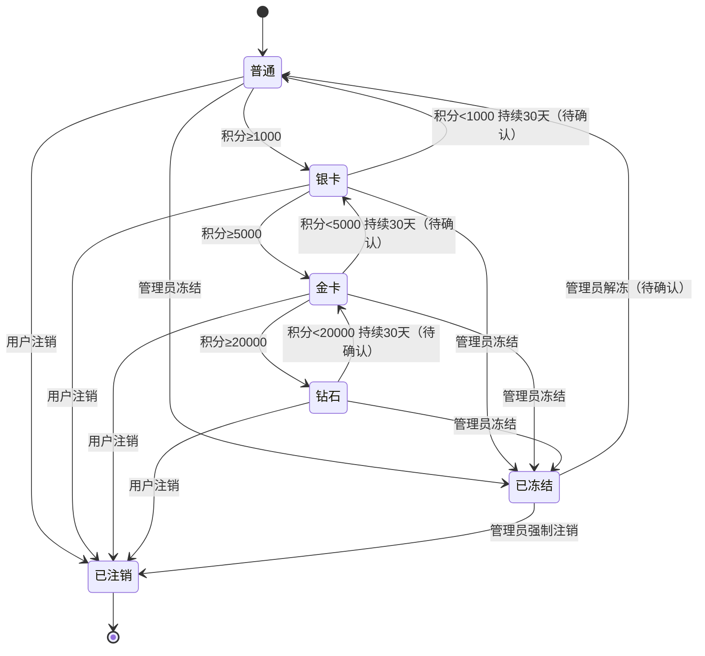

# 行业模板：会员状态机

> **何时使用**：用户提到会员/积分/等级/冻结/注销等场景时，作为参考模板。
> **覆盖范围**：6 状态会员生命周期 / 升级/降级/冻结/解冻/注销 / 终态吸收。

## 1. 业务背景

会员体系，涉及用户、系统、管理员、定时器四类参与者。会员从注册到注销有 6 个状态，含升级/降级/冻结/解冻等流程。

## 2. 状态机模型

```yaml
state_machine:
  meta:
    object: Membership
    version: 1.0
    source: 会员系统通用规则
    confidence: medium
  states:
    - name: 普通
      meaning: 注册用户，无会员等级
      is_initial: true
      is_terminal: false
      entry_events: [用户注册]
      invariants:
        - 无会员权益
    - name: 银卡
      meaning: 银卡会员，基础权益
      is_terminal: false
      entry_events: [积分达标升级]
      invariants:
        - 银卡权益已生效
        - 升级时间已记录
    - name: 金卡
      meaning: 金卡会员，进阶权益
      is_terminal: false
      entry_events: [积分达标升级]
      invariants:
        - 金卡权益已生效
        - 升级时间已记录
    - name: 钻石
      meaning: 钻石会员，顶级权益
      is_terminal: false
      entry_events: [积分达标升级]
      invariants:
        - 钻石权益已生效
        - 升级时间已记录
    - name: 已冻结
      meaning: 会员因违规或风控被冻结
      is_terminal: false
      entry_events: [管理员冻结, 风控触发]
      invariants:
        - 会员权益暂停
        - 冻结原因已记录
    - name: 已注销
      meaning: 会员主动注销，账号已停用
      is_terminal: true
      entry_events: [用户注销]
      invariants:
        - 账号不可恢复
        - 个人数据已脱敏
  transitions:
    - from: 普通
      to: 银卡
      event: 积分达标升级
      guards: [积分 ≥ 1000]
      side_effects: [生效银卡权益, 通知用户]
      evidence_type: 需求明确
      source: PRD §3.1
    - from: 银卡
      to: 金卡
      event: 积分达标升级
      guards: [积分 ≥ 5000]
      side_effects: [生效金卡权益, 通知用户]
      evidence_type: 需求明确
      source: PRD §3.1
    - from: 金卡
      to: 钻石
      event: 积分达标升级
      guards: [积分 ≥ 20000]
      side_effects: [生效钻石权益, 通知用户]
      evidence_type: 需求明确
      source: PRD §3.1
    - from: 钻石
      to: 金卡
      event: 积分降级
      guards: [积分 < 20000, 持续 30 天]
      side_effects: [降级金卡权益, 通知用户]
      evidence_type: 待确认
      source: PRD 未说明降级规则
    - from: 金卡
      to: 银卡
      event: 积分降级
      guards: [积分 < 5000, 持续 30 天]
      side_effects: [降级银卡权益, 通知用户]
      evidence_type: 待确认
      source: PRD 未说明降级规则
    - from: 银卡
      to: 普通
      event: 积分降级
      guards: [积分 < 1000, 持续 30 天]
      side_effects: [取消银卡权益, 通知用户]
      evidence_type: 待确认
      source: PRD 未说明降级规则
    - from: 普通
      to: 已冻结
      event: 管理员冻结
      guards: [冻结原因已填写]
      side_effects: [暂停权益, 记录冻结原因]
      evidence_type: 需求明确
      source: PRD §3.2
    - from: 银卡
      to: 已冻结
      event: 管理员冻结
      guards: [冻结原因已填写]
      side_effects: [暂停权益, 记录冻结原因]
      evidence_type: 需求明确
      source: PRD §3.2
    - from: 金卡
      to: 已冻结
      event: 管理员冻结
      guards: [冻结原因已填写]
      side_effects: [暂停权益, 记录冻结原因]
      evidence_type: 需求明确
      source: PRD §3.2
    - from: 钻石
      to: 已冻结
      event: 管理员冻结
      guards: [冻结原因已填写]
      side_effects: [暂停权益, 记录冻结原因]
      evidence_type: 需求明确
      source: PRD §3.2
    - from: 已冻结
      to: 普通
      event: 管理员解冻
      guards: [冻结原因已解除]
      side_effects: [恢复权益（降为普通）, 通知用户]
      evidence_type: 待确认
      source: PRD 未说明解冻后恢复到哪个等级
    - from: 普通
      to: 已注销
      event: 用户注销
      side_effects: [脱敏个人数据, 释放资源]
      evidence_type: 需求明确
      source: PRD §3.3
    - from: 银卡
      to: 已注销
      event: 用户注销
      side_effects: [脱敏个人数据, 释放资源, 取消银卡权益]
      evidence_type: 需求明确
      source: PRD §3.3
    - from: 金卡
      to: 已注销
      event: 用户注销
      side_effects: [脱敏个人数据, 释放资源, 取消金卡权益]
      evidence_type: 需求明确
      source: PRD §3.3
    - from: 钻石
      to: 已注销
      event: 用户注销
      side_effects: [脱敏个人数据, 释放资源, 取消钻石权益]
      evidence_type: 需求明确
      source: PRD §3.3
    - from: 已冻结
      to: 已注销
      event: 管理员强制注销
      side_effects: [脱敏个人数据, 释放资源, 记录强制注销]
      evidence_type: 需求明确
      source: PRD §3.3
  forbidden:
    - from: 已注销
      to: "*"
      reason: 终态吸收
      evidence_type: 需求明确
    - from: 已冻结
      to: 钻石
      reason: 冻结期间不可直接升级
      evidence_type: 合理推理
    - from: 已冻结
      to: 金卡
      reason: 冻结期间不可直接升级
      evidence_type: 合理推理
    - from: 已冻结
      to: 银卡
      reason: 冻结期间不可直接升级
      evidence_type: 合理推理
```

## 3. 完整性检查报告

```yaml
completeness_report:
  overall_status: warn
  checks:
    - check_id: C1
      status: pass
    - check_id: C2
      status: pass
    - check_id: C3
      status: pass
    - check_id: C4
      status: pass
    - check_id: C5
      status: warn
      detail: 需澄清降级规则（持续 30 天 / 即时降级 / 不降级）
    - check_id: C6
      status: pass
    - check_id: C7
      status: pass
    - check_id: C8
      status: pass
    - check_id: C9
      status: pass
  gaps:
    - id: GAP-001
      description: 降级规则未明确
      evidence_type: 待确认
      suggestion: 需澄清降级是即时/持续 30 天/不降级
      related_check: C5
    - id: GAP-002
      description: 解冻后恢复到哪个等级未明确
      evidence_type: 待确认
      suggestion: 需澄清解冻后是恢复原等级/降为普通/由管理员指定
      related_state: 已冻结
```

## 4. 10 类场景示例（每类 1 条，节选）

```yaml
scenarios:
  - id: SM-001
    title: 普通会员积分达 1000 后升级为银卡
    current_state: 普通
    trigger_event: 积分达标升级
    precondition: 普通会员，积分 ≥ 1000
    expected_target_state: 银卡
    forbidden_states: [已注销]
    risk_type: legal_transition
    related_objects: [会员, 积分记录]
    evidence_type: 需求明确
    source: PRD §3.1

  - id: SM-002
    title: 已注销会员尝试升级应被拒绝
    current_state: 已注销
    trigger_event: 积分达标升级
    precondition: 会员已注销
    expected_target_state: 已注销（保持不变）
    forbidden_states: [银卡, 金卡, 钻石]
    risk_type: illegal_transition
    related_objects: [会员, 积分记录]
    evidence_type: 需求明确
    source: 状态机 forbidden 规则（终态吸收）

  - id: SM-003
    title: 普通会员积分 999 时尝试升级应被拒绝
    current_state: 普通
    trigger_event: 积分达标升级
    precondition: 普通会员，积分 = 999（未达 1000）
    expected_target_state: 普通（保持不变）
    forbidden_states: [银卡]
    risk_type: guard_violation
    related_objects: [会员, 积分记录]
    evidence_type: 合理推理
    source: 状态机 transitions 中 guard "积分 ≥ 1000" 的反向

  - id: SM-004
    title: 积分变更事件重复到达不应重复升级
    current_state: 银卡
    trigger_event: 积分达标升级（重复）
    precondition: 已是银卡，收到第二次升级事件
    expected_target_state: 银卡（保持不变）
    forbidden_states: [重复生效权益]
    risk_type: idempotency
    related_objects: [会员, 权益记录]
    evidence_type: 合理推理
    source: 业务常识

  - id: SM-005
    title: 用户注销与管理员冻结并发时最终状态正确
    current_state: 金卡
    trigger_event: 用户注销 + 管理员冻结（同时到达）
    precondition: 金卡会员，用户点注销的同时管理员点冻结
    expected_target_state: 待确认
    forbidden_states: []
    risk_type: concurrency
    related_objects: [会员, 锁机制, 操作日志]
    evidence_type: 待确认
    source: PRD 未说明并发处理规则

  - id: SM-006
    title: 积分变更消息乱序到达时等级正确
    current_state: 银卡
    trigger_event: 积分增加 + 积分扣减（乱序到达）
    precondition: 银卡会员，积分变更消息乱序
    expected_target_state: 待确认
    forbidden_states: []
    risk_type: message_reorder
    related_objects: [消息队列, 积分记录]
    evidence_type: 待确认
    source: PRD 未说明乱序时以最终值/最后一条为准

  - id: SM-007
    title: 会员长期未活跃应自动降级或通知
    current_state: 钻石
    trigger_event: 超时定时器（90 天未活跃）
    precondition: 钻石会员，90 天未消费
    expected_target_state: 待确认
    forbidden_states: []
    risk_type: timeout_retry
    related_objects: [定时任务, 会员, 通知系统]
    evidence_type: 待确认
    source: PRD 未说明未活跃处理规则

  - id: SM-008
    title: 升级后会员等级与权益记录一致
    current_state: 普通
    trigger_event: 积分达标升级
    precondition: 普通会员，积分达 1000
    expected_target_state: 银卡
    forbidden_states: [会员等级与权益记录不一致]
    risk_type: data_consistency
    related_objects: [会员, 权益记录, 积分记录]
    evidence_type: 合理推理
    source: 状态机 transitions 中 side_effects 的验证

  - id: SM-009
    title: 普通用户尝试管理员冻结操作应被拒绝
    current_state: 金卡
    trigger_event: 管理员冻结（普通用户冒充）
    precondition: 操作者为普通用户，无管理员权限
    expected_target_state: 金卡（保持不变）
    forbidden_states: [已冻结]
    risk_type: access_control
    related_objects: [权限系统, 操作日志]
    evidence_type: 待确认
    source: PRD 未说明冻结权限矩阵

  - id: SM-010
    title: 升级过程中系统故障后状态恢复
    current_state: 普通
    trigger_event: 系统故障恢复
    precondition: 升级到银卡过程中系统故障
    expected_target_state: 待确认
    forbidden_states: []
    risk_type: failure_recovery
    related_objects: [会员, 系统日志, 数据库]
    evidence_type: 待确认
    source: PRD 未说明故障恢复策略
```

## 5. Mermaid 状态图



## 6. 待确认项汇总

| ID | 待确认问题 | 影响范围 |
|---|---|---|
| GAP-001 | 降级规则（即时/持续 30 天/不降级） | 所有降级 transition |
| GAP-002 | 解冻后恢复到哪个等级 | 已冻结 → 普通 转换 |
| AMB-001 | 未活跃处理规则（降级/通知/无操作） | timeout_retry 类场景 |
| AMB-002 | 积分变更消息乱序时以何为准 | message_reorder 类场景 |
| AMB-003 | 冻结权限矩阵（仅管理员/客服/风控系统） | access_control 类场景 |

---

**相关模板**：
- [order-refund.md](order-refund.md) - 订单退款状态机
- [approval-flow.md](approval-flow.md) - 审批流状态机
- [ticket.md](ticket.md) - 工单状态机

**相关文档**：
- [../state-modeling.md](../state-modeling.md) - 状态机建模方法论
- [../scenario-types.md](../scenario-types.md) - 10 类场景穷举规则
- [../../state-machine-core.md](../../state-machine-core.md) - 核心流程详述
