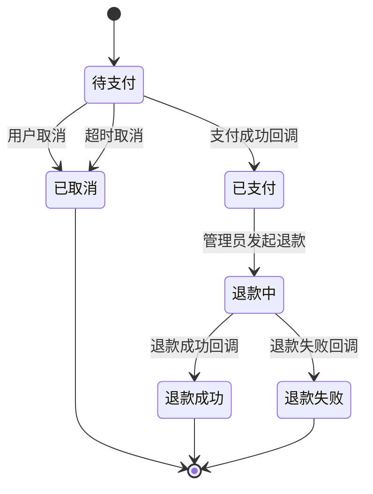

# 行业模板：订单退款状态机

> **何时使用**：用户提到订单/退款/支付/取消等电商场景时，作为参考模板。
> **来源**：文章案例（state-machine-test-engineer 设计的原始灵感）。
> **覆盖范围**：6 状态完整建模 / transitions / forbidden / 完整性检查 / 10 类场景示例。

## 1. 业务背景

电商订单退款流程，涉及用户、支付渠道、管理员、定时器四类参与者。订单从创建到退款结束有 6 个状态，含支付/取消/退款三类核心流程。

## 2. 状态机模型

```yaml
state_machine:
  meta:
    object: Order
    version: 1.0
    source: 文章案例 + 业务常识
    confidence: high
  states:
    - name: 待支付
      meaning: 订单已创建未支付
      is_initial: true
      is_terminal: false
      entry_events: [订单创建]
      invariants:
        - 订单金额不可修改
        - 订单项不可删除
    - name: 已支付
      meaning: 订单已支付，等待履约
      is_terminal: false
      entry_events: [支付成功回调]
      invariants:
        - 支付金额不可修改
        - 支付时间不可篡改
    - name: 已取消
      meaning: 订单已取消，不可再支付
      is_terminal: true
      entry_events: [用户取消, 超时取消]
      invariants:
        - 不可再次支付
        - 库存已释放
    - name: 退款中
      meaning: 退款申请已受理，等待渠道处理
      is_terminal: false
      entry_events: [管理员发起退款]
      invariants:
        - 退款金额不可修改
        - 退款申请记录已生成
    - name: 退款成功
      meaning: 退款已完成，资金已退回
      is_terminal: true
      entry_events: [退款成功回调]
      invariants:
        - 退款金额不可再修改
        - 不可再次发起退款
    - name: 退款失败
      meaning: 退款失败，等待处理
      is_terminal: true
      entry_events: [退款失败回调]
      invariants:
        - 退款失败记录已生成
        - 后续路径待确认
  transitions:
    - from: 待支付
      to: 已支付
      event: 支付成功回调
      guards: [订单有效, 金额一致, 回调可信]
      side_effects: [生成支付记录, 触发履约, 通知用户]
      evidence_type: 需求明确
      source: PRD §3.2
    - from: 待支付
      to: 已取消
      event: 用户取消
      side_effects: [释放库存, 通知用户]
      evidence_type: 需求明确
      source: PRD §3.3
    - from: 待支付
      to: 已取消
      event: 超时取消
      guards: [创建后 30 分钟未支付]
      side_effects: [释放库存, 标记超时]
      evidence_type: 合理推理
      source: 业务常识（PRD 可能未提超时时长）
    - from: 已支付
      to: 退款中
      event: 管理员发起退款
      guards: [订单已支付, 退款金额有效]
      side_effects: [生成退款申请, 调用退款渠道]
      evidence_type: 需求明确
      source: PRD §3.4
    - from: 退款中
      to: 退款成功
      event: 退款成功回调
      guards: [回调可信, 退款金额一致]
      side_effects: [更新退款记录, 通知用户, 释放履约]
      evidence_type: 需求明确
      source: PRD §3.5
    - from: 退款中
      to: 退款失败
      event: 退款失败回调
      guards: [回调可信]
      side_effects: [更新退款记录, 通知用户]
      evidence_type: 需求明确
      source: PRD §3.5
  forbidden:
    - from: 已取消
      to: 已支付
      reason: 已取消订单不可支付
      evidence_type: 需求明确
      source: PRD §3.3
    - from: 已取消
      to: 退款中
      reason: 已取消订单不可退款
      evidence_type: 合理推理
      source: 业务常识
    - from: 退款成功
      to: "*"
      reason: 终态吸收
      evidence_type: 需求明确
      source: PRD §3.5
    - from: 退款失败
      to: "*"
      reason: 终态吸收
      evidence_type: 待确认
      source: PRD 未说明退款失败后能否重新发起
```

## 3. 完整性检查报告

```yaml
completeness_report:
  overall_status: warn
  checks:
    - check_id: C1
      name: 每个状态有明确含义
      status: pass
    - check_id: C2
      name: 每个状态有进入条件（除初始态）
      status: pass
    - check_id: C3
      name: 每个非终态有退出路径
      status: pass
    - check_id: C4
      name: 终态真的不可变化
      status: pass
    - check_id: C5
      name: 禁止转换无遗漏
      status: warn
      detail: 需人工审视"已支付 → 待支付"等异常路径是否需要 forbidden
    - check_id: C6
      name: 状态变化有副作用定义
      status: pass
    - check_id: C7
      name: 依据类型已标注
      status: pass
    - check_id: C8
      name: 无悬挂状态
      status: pass
    - check_id: C9
      name: 无死锁状态
      status: pass
  gaps:
    - id: GAP-001
      description: 退款失败后的恢复路径未定义
      evidence_type: 待确认
      suggestion: 需澄清退款失败后是允许重新发起/回退到已支付/保持退款失败终态
      related_state: 退款失败
      related_check: C5
```

## 4. 10 类场景示例（每类 1 条）

```yaml
scenarios:
  - id: SM-001
    title: 待支付订单收到支付成功回调后转为已支付
    current_state: 待支付
    trigger_event: 支付成功回调
    precondition: 订单处于待支付状态，金额一致，回调可信
    expected_target_state: 已支付
    forbidden_states: [已取消, 退款成功]
    risk_type: legal_transition
    related_objects: [支付记录, 订单日志]
    evidence_type: 需求明确
    source: PRD §3.2 + 状态机 transitions

  - id: SM-002
    title: 已取消订单尝试支付应被拒绝
    current_state: 已取消
    trigger_event: 支付成功回调
    precondition: 订单已取消
    expected_target_state: 已取消（保持不变）
    forbidden_states: [已支付]
    risk_type: illegal_transition
    related_objects: [支付记录, 订单日志]
    evidence_type: 需求明确
    source: PRD §3.1 + 状态机 forbidden 规则

  - id: SM-003
    title: 待支付订单收到金额不一致的支付回调应被拒绝
    current_state: 待支付
    trigger_event: 支付成功回调
    precondition: 订单处于待支付状态，但回调金额 ≠ 订单金额
    expected_target_state: 待支付（保持不变）
    forbidden_states: [已支付]
    risk_type: guard_violation
    related_objects: [支付记录, 风控日志]
    evidence_type: 合理推理
    source: 状态机 transitions 中 guard "金额一致" 的反向

  - id: SM-004
    title: 支付成功回调重复到达不应重复更新订单状态
    current_state: 已支付
    trigger_event: 支付成功回调（重复）
    precondition: 订单已是已支付状态，收到第二次支付成功回调
    expected_target_state: 已支付（保持不变）
    forbidden_states: [重复生成支付记录]
    risk_type: idempotency
    related_objects: [支付记录, 订单日志, 消息队列]
    evidence_type: 合理推理
    source: 业务常识（支付回调可能因网络重试重复到达）

  - id: SM-005
    title: 用户取消与支付回调并发时最终状态正确
    current_state: 待支付
    trigger_event: 用户取消 + 支付成功回调（同时到达）
    precondition: 订单处于待支付状态，用户点取消的同时收到支付成功回调
    expected_target_state: 待确认
    forbidden_states: []
    risk_type: concurrency
    related_objects: [订单日志, 支付记录, 锁机制]
    evidence_type: 待确认
    source: PRD 未说明并发处理规则

  - id: SM-006
    title: 退款失败回调先于退款成功回调到达时状态正确
    current_state: 退款中
    trigger_event: 退款失败回调 + 退款成功回调（乱序到达）
    precondition: 退款处理中，两条回调消息乱序到达
    expected_target_state: 待确认
    forbidden_states: []
    risk_type: message_reorder
    related_objects: [消息队列, 退款记录, 订单日志]
    evidence_type: 待确认
    source: PRD 未说明消息乱序处理规则

  - id: SM-007
    title: 待支付订单 30 分钟未支付应自动取消
    current_state: 待支付
    trigger_event: 超时定时器触发（30 分钟）
    precondition: 订单创建后 30 分钟未收到支付回调
    expected_target_state: 已取消
    forbidden_states: [已支付]
    risk_type: timeout_retry
    related_objects: [定时任务, 订单日志]
    evidence_type: 合理推理
    source: 业务常识（PRD 可能未提超时时长）

  - id: SM-008
    title: 待支付转已支付后支付记录与订单状态一致
    current_state: 待支付
    trigger_event: 支付成功回调
    precondition: 订单处于待支付状态，收到合法支付回调
    expected_target_state: 已支付
    forbidden_states: [支付记录与订单状态不一致]
    risk_type: data_consistency
    related_objects: [订单, 支付记录, 履约单]
    evidence_type: 合理推理
    source: 状态机 transitions 中 side_effects 的验证

  - id: SM-009
    title: 普通用户尝试管理员退款操作应被拒绝
    current_state: 已支付
    trigger_event: 管理员发起退款（普通用户冒充）
    precondition: 用户为普通用户，无管理员权限
    expected_target_state: 已支付（保持不变）
    forbidden_states: [退款中]
    risk_type: access_control
    related_objects: [权限系统, 操作日志]
    evidence_type: 待确认
    source: PRD 未说明退款操作权限矩阵

  - id: SM-010
    title: 退款中执行退款失败回调后状态恢复路径
    current_state: 退款中
    trigger_event: 退款失败回调
    precondition: 订单处于退款中状态，收到退款失败回调
    expected_target_state: 退款失败
    forbidden_states: []
    risk_type: failure_recovery
    related_objects: [退款记录, 订单日志, 通知系统]
    evidence_type: 需求明确
    source: PRD §3.5 + 状态机 transitions
```

## 5. Mermaid 状态图



## 6. 待确认项汇总

| ID | 待确认问题 | 影响范围 |
|---|---|---|
| GAP-001 | 退款失败后的恢复路径（重新发起/回退/保持终态） | 退款失败状态的所有场景 |
| AMB-001 | 超时时长是 15/30/60 分钟 | timeout_retry 类场景 |
| AMB-002 | 用户取消与支付回调并发的优先级 | concurrency 类场景 |
| AMB-003 | 退款操作权限矩阵（仅管理员/客服/用户） | access_control 类场景 |
| AMB-004 | 消息乱序时以哪条消息为准 | message_reorder 类场景 |

---

**相关模板**：
- [approval-flow.md](approval-flow.md) - 审批流状态机
- [membership.md](membership.md) - 会员状态机
- [ticket.md](ticket.md) - 工单状态机

**相关文档**：
- [../state-modeling.md](../state-modeling.md) - 状态机建模方法论
- [../scenario-types.md](../scenario-types.md) - 10 类场景穷举规则
- [../../state-machine-core.md](../../state-machine-core.md) - 核心流程详述
