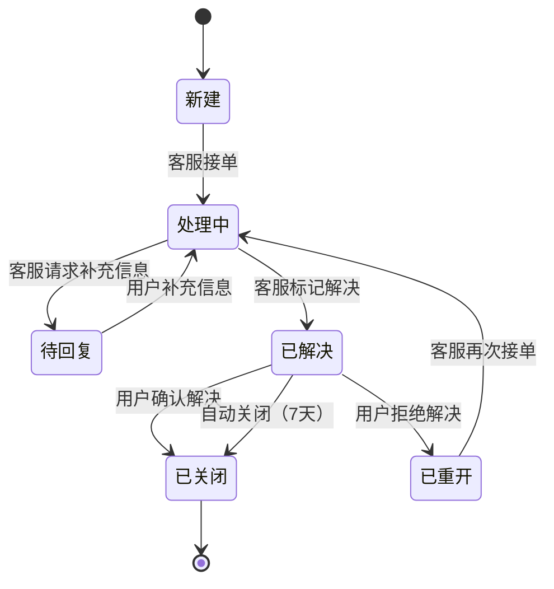

# 行业模板：工单状态机

> **何时使用**：用户提到工单/客服/issue/帮助请求等场景时，作为参考模板。
> **覆盖范围**：6 状态工单生命周期 / 重开/转派/关闭 / 终态吸收。

## 1. 业务背景

客服工单系统，涉及用户、客服、管理员、定时器四类参与者。工单从创建到关闭有 6 个状态，含处理/转派/重开/关闭等流程。

## 2. 状态机模型

```yaml
state_machine:
  meta:
    object: Ticket
    version: 1.0
    source: 工单系统通用规则
    confidence: medium
  states:
    - name: 新建
      meaning: 工单已创建，待分配客服
      is_initial: true
      is_terminal: false
      entry_events: [用户提交工单]
      invariants:
        - 工单内容不可修改
        - 创建时间已记录
    - name: 处理中
      meaning: 客服已分配并正在处理
      is_terminal: false
      entry_events: [客服接单]
      invariants:
        - 处理客服已指定
        - 处理记录已开始
    - name: 待回复
      meaning: 等待用户补充信息或确认
      is_terminal: false
      entry_events: [客服请求补充信息]
      invariants:
        - 等待计时已开始
        - 待回复问题已记录
    - name: 已解决
      meaning: 客服标记已解决，等待用户确认
      is_terminal: false
      entry_events: [客服标记解决]
      invariants:
        - 解决方案已记录
        - 用户确认倒计时已开始
    - name: 已关闭
      meaning: 工单最终关闭，不可再操作
      is_terminal: true
      entry_events: [用户确认解决, 自动关闭]
      invariants:
        - 关闭时间已记录
        - 不可再重开
    - name: 已重开
      meaning: 用户对已解决工单不满意，重新打开
      is_terminal: false
      entry_events: [用户拒绝解决]
      invariants:
        - 重开原因已记录
        - 必须重新进入处理中
  transitions:
    - from: 新建
      to: 处理中
      event: 客服接单
      side_effects: [分配客服, 通知用户, 开始SLA计时]
      evidence_type: 需求明确
      source: PRD §2.1
    - from: 处理中
      to: 待回复
      event: 客服请求补充信息
      side_effects: [记录待回复问题, 通知用户, 暂停SLA]
      evidence_type: 需求明确
      source: PRD §2.2
    - from: 待回复
      to: 处理中
      event: 用户补充信息
      side_effects: [记录补充内容, 恢复SLA, 通知客服]
      evidence_type: 需求明确
      source: PRD §2.3
    - from: 处理中
      to: 已解决
      event: 客服标记解决
      guards: [解决方案已填写]
      side_effects: [记录解决方案, 通知用户确认, 开始确认倒计时]
      evidence_type: 需求明确
      source: PRD §2.4
    - from: 已解决
      to: 已关闭
      event: 用户确认解决
      side_effects: [记录关闭时间, 归档工单]
      evidence_type: 需求明确
      source: PRD §2.5
    - from: 已解决
      to: 已关闭
      event: 自动关闭
      guards: [用户 7 天未响应]
      side_effects: [记录自动关闭, 归档工单]
      evidence_type: 合理推理
      source: 业务常识（PRD 可能未提自动关闭时长）
    - from: 已解决
      to: 已重开
      event: 用户拒绝解决
      guards: [在确认倒计时内]
      side_effects: [记录重开原因, 通知客服]
      evidence_type: 需求明确
      source: PRD §2.6
    - from: 已重开
      to: 处理中
      event: 客服再次接单
      side_effects: [恢复处理, 通知用户, 重置SLA]
      evidence_type: 需求明确
      source: PRD §2.7
  forbidden:
    - from: 已关闭
      to: "*"
      reason: 终态吸收
      evidence_type: 需求明确
    - from: 新建
      to: 已解决
      reason: 必须经过处理中状态
      evidence_type: 合理推理
    - from: 新建
      to: 已关闭
      reason: 必须经过处理中状态
      evidence_type: 合理推理
    - from: 待回复
      to: 已解决
      reason: 待回复状态下不可直接解决
      evidence_type: 合理推理
```

## 3. 完整性检查报告

```yaml
completeness_report:
  overall_status: warn
  checks:
    - check_id: C1
      status: pass
    - check_id: C2
      status: pass
    - check_id: C3
      status: pass
    - check_id: C4
      status: pass
    - check_id: C5
      status: warn
      detail: 需澄清"待回复超时"是否自动关闭/转派
    - check_id: C6
      status: pass
    - check_id: C7
      status: pass
    - check_id: C8
      status: pass
    - check_id: C9
      status: pass
  gaps:
    - id: GAP-001
      description: 待回复超时处理规则未明确
      evidence_type: 待确认
      suggestion: 需澄清待回复超过 N 天后是自动关闭/转派/催办
      related_state: 待回复
    - id: GAP-002
      description: 重开次数是否有限制未明确
      evidence_type: 待确认
      suggestion: 需澄清工单是否可无限次重开
      related_state: 已重开
```

## 4. 10 类场景示例（每类 1 条，节选）

```yaml
scenarios:
  - id: SM-001
    title: 新建工单客服接单后转为处理中
    current_state: 新建
    trigger_event: 客服接单
    precondition: 工单已创建，待分配
    expected_target_state: 处理中
    forbidden_states: [已关闭]
    risk_type: legal_transition
    related_objects: [工单, 客服, SLA 记录]
    evidence_type: 需求明确
    source: PRD §2.1

  - id: SM-002
    title: 已关闭工单尝试重开应被拒绝
    current_state: 已关闭
    trigger_event: 用户拒绝解决
    precondition: 工单已关闭
    expected_target_state: 已关闭（保持不变）
    forbidden_states: [已重开]
    risk_type: illegal_transition
    related_objects: [工单, 操作日志]
    evidence_type: 需求明确
    source: 状态机 forbidden 规则（终态吸收）

  - id: SM-003
    title: 客服未填解决方案尝试标记解决应被拒绝
    current_state: 处理中
    trigger_event: 客服标记解决
    precondition: 解决方案未填写
    expected_target_state: 处理中（保持不变）
    forbidden_states: [已解决]
    risk_type: guard_violation
    related_objects: [工单, 解决方案记录]
    evidence_type: 合理推理
    source: 状态机 transitions 中 guard "解决方案已填写" 的反向

  - id: SM-004
    title: 用户确认解决事件重复到达不应重复关闭
    current_state: 已解决
    trigger_event: 用户确认解决（重复）
    precondition: 工单已是已解决状态，收到第二次确认
    expected_target_state: 已解决（保持不变，等待自动关闭或首次确认）
    forbidden_states: [重复归档]
    risk_type: idempotency
    related_objects: [工单, 归档记录]
    evidence_type: 合理推理
    source: 业务常识

  - id: SM-005
    title: 用户确认解决与用户拒绝解决并发时最终状态正确
    current_state: 已解决
    trigger_event: 用户确认解决 + 用户拒绝解决（同时到达）
    precondition: 已解决状态，用户同时点击确认和拒绝
    expected_target_state: 待确认
    forbidden_states: []
    risk_type: concurrency
    related_objects: [工单, 锁机制, 操作日志]
    evidence_type: 待确认
    source: PRD 未说明并发处理规则

  - id: SM-006
    title: 用户补充信息与客服标记解决消息乱序时状态正确
    current_state: 待回复
    trigger_event: 用户补充信息 + 客服标记解决（乱序）
    precondition: 待回复状态，用户补充与客服解决消息乱序
    expected_target_state: 待确认
    forbidden_states: []
    risk_type: message_reorder
    related_objects: [消息队列, 工单日志]
    evidence_type: 待确认
    source: PRD 未说明乱序时以哪条消息为准

  - id: SM-007
    title: 已解决工单 7 天用户未响应应自动关闭
    current_state: 已解决
    trigger_event: 超时定时器（7 天）
    precondition: 已解决状态，7 天未收到用户响应
    expected_target_state: 已关闭
    forbidden_states: []
    risk_type: timeout_retry
    related_objects: [定时任务, 工单, 通知系统]
    evidence_type: 合理推理
    source: 业务常识（PRD 可能未提自动关闭时长）

  - id: SM-008
    title: 工单关闭后归档记录与工单状态一致
    current_state: 已解决
    trigger_event: 用户确认解决
    precondition: 已解决状态，用户确认
    expected_target_state: 已关闭
    forbidden_states: [归档记录与工单状态不一致]
    risk_type: data_consistency
    related_objects: [工单, 归档记录, 通知系统]
    evidence_type: 合理推理
    source: 状态机 transitions 中 side_effects 的验证

  - id: SM-009
    title: 非分配客服尝试处理工单应被拒绝
    current_state: 处理中
    trigger_event: 客服标记解决（非分配客服操作）
    precondition: 操作者为非分配客服
    expected_target_state: 处理中（保持不变）
    forbidden_states: [已解决]
    risk_type: access_control
    related_objects: [权限系统, 工单, 操作日志]
    evidence_type: 待确认
    source: PRD 未说明工单处理权限规则

  - id: SM-010
    title: 工单处理中系统故障后状态恢复
    current_state: 处理中
    trigger_event: 系统故障恢复
    precondition: 处理中状态时系统故障
    expected_target_state: 处理中（应保持不变）
    forbidden_states: []
    risk_type: failure_recovery
    related_objects: [工单, 系统日志, 数据库]
    evidence_type: 待确认
    source: PRD 未说明故障恢复策略
```

## 5. Mermaid 状态图



## 6. 待确认项汇总

| ID | 待确认问题 | 影响范围 |
|---|---|---|
| GAP-001 | 待回复超时处理规则（自动关闭/转派/催办） | 待回复状态的所有场景 |
| GAP-002 | 重开次数限制（无限/最多 N 次） | 已重开状态的所有场景 |
| AMB-001 | 自动关闭时长（7 天/15 天/30 天） | timeout_retry 类场景 |
| AMB-002 | 工单处理权限（仅分配客服/同组客服/管理员） | access_control 类场景 |
| AMB-003 | SLA 超时是通知/自动升级/无操作 | timeout_retry 类场景 |

---

**相关模板**：
- [order-refund.md](order-refund.md) - 订单退款状态机
- [approval-flow.md](approval-flow.md) - 审批流状态机
- [membership.md](membership.md) - 会员状态机

**相关文档**：
- [../state-modeling.md](../state-modeling.md) - 状态机建模方法论
- [../scenario-types.md](../scenario-types.md) - 10 类场景穷举规则
- [../../state-machine-core.md](../../state-machine-core.md) - 核心流程详述
